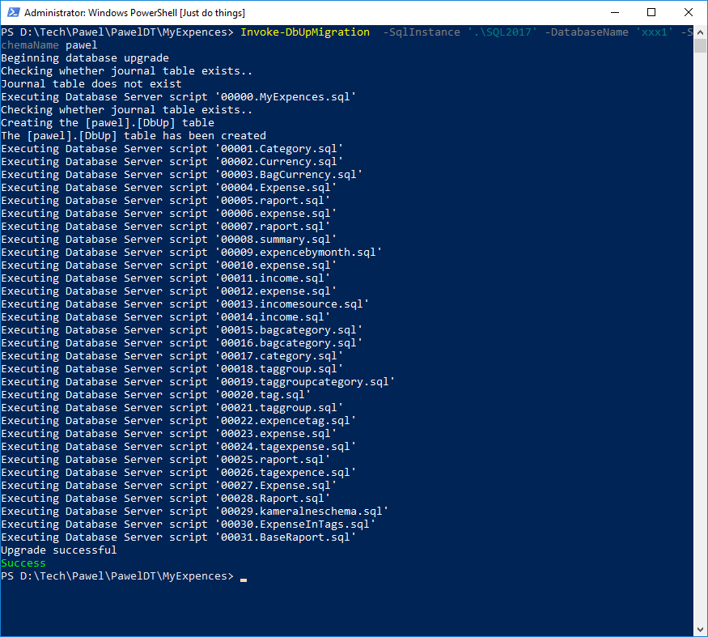

<!--Category:Powershell--> 
 <p align="right">
    <a href="https://www.powershellgallery.com/packages/ProductivityTools.PSDbUp/"></a>
    <a href="http://productivitytools.tech/psdbup/"><a> 
    <a href="https://github.com/pwujczyk/ProductivityTools.PSDbUp"></a>
</p>
<p align="center">
    <a href="http://productivitytools.tech/">
        
    </a>
</p>

# ProductivityTools.PSDbUp

Module invokes DBUp from PowerShell for  given directory.

Often I am starting application with gathering data. First I am creating database, next I create some simple form in Microsoft Access and later if whole idea make sense I am adding Windows application. This module helps me to create database in structired way and later use written scripts in final application.

Go to the directory with the scripts and call  Invoke-DbUpMigration

```
Invoke-DbUpMigration -SqlInstance '.\SQL2019' -DatabaseName 'xxx1' -SchemaName pawel
```



One not obvious param is SchemaName. Setting it will impact schema under which DBUp Log will be saved.


## New-DbUpMigration

Module also exposes cmdlet which help in creating the new migration. When executed in the directory with previous scripts it checks last number assigned to migration and create new one with provided content.
