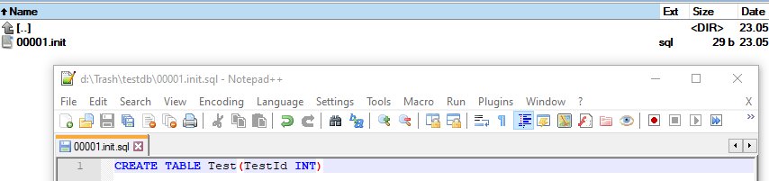

<!--Category:Powershell--> 
 <p align="right">
    <a href="https://www.powershellgallery.com/packages/ProductivityTools.PSDbUp/"></a>
    <a href="http://productivitytools.tech/psdbup/"><a> 
    <a href="https://github.com/pwujczyk/ProductivityTools.PSDbUp"></a>
</p>
<p align="center">
    <a href="http://productivitytools.tech/">
        
    </a>
</p>

# ProductivityTools.PSDbUp

Module invokes DBUp from PowerShell for  given directory.

Often I am starting application with gathering data. First I am creating database, next I create some simple form in Microsoft Access and later if whole idea make sense I am adding Windows application. This module helps me to create database in structured way and later use written scripts in final application.

## New-DbUpMigration

Module exposes cmdlet which help in creating the new migration. When executed in the directory with previous scripts it checks last number assigned to migration and create new one with provided content.


```PowerShell
New-DbUpMigration -Name "init" -Content "CREATE TABLE Test(TestId INT" -Verbose
```

Above command will create in directory SQL file with provided content.



## Invoke-DbUpMigration

If scripts are created we can go to the directory with them and call  Invoke-DbUpMigration

```
Invoke-DbUpMigration -SqlInstance '.\sql2019' -DatabaseName "Test123" -SchemaName "dbup" -Verbose
```


Scripts should be invoked. 

**Module doesn't create the database**, you need to create it manually.


### SchemaName - parameter tell in which schema migration log table should be created
